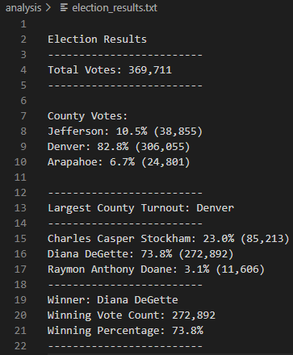

# Election Results Challenge
[Election Results Challenge](./PyPoll_Challenge.py)
## Overview of Election Audit
Assist a Colorado Board of ELections employee, Tom, in an election audit of the tabulated results for a U.S. Congressional precinct in Colorado. Find the election outcomes for voting in counties and for the individual candidates.

Report the following:

1. The total number of votes cast.
2. A complete list of candidates who received votes.
3. The percentage of votes each candidate won.
4. The total number of votes each candidate won.
5. The winner of the election based on popular vote.

## Resources
- Data Source: [election_results.csv](./election_results.csv)
- Software: Python 3.7.6, Visual Studio Code 1.68.1

## Election-Audit Results

The analysis of the election results show that:

- There were 369,711 votes cast in the election.

- The candidates were:
  - Charles Casper Stockham
  - Diana Degette
  - Raymon Anthony Doane
  
- The counties voting were:
  - Jefferson
  - Denver
  - Arapahoe
 
- The counties' voting results were:
  - Jefferson had 10.5% of the vote, with 38,855 people voting from there.
  - Denver had 82.8% of the vote, with 272,892 people voting from there.
  - Arapahoe had 6.7% of the vote, with 11,606 people voting from there.
 
- The largest voter turnout was in Denver.
 
- The candidate results were:
   - Charles Casper Stockham received 23.0% of the vote and 85,213 number of votes.
   - Diana DeGette received 73.8% of the vote and 272,892 number of votes.
   - Raymon Anthony Doane received 3.1% of the vote and 11,606 number of votes.

- The winner of the election was Diana Degette, who received 73.8% of the vote and 272,892 number of vote.

## Election-Audit Summary
From these results, we can see that it would be beneficial for candidates to campaign in Denver primarily due to Denver having the highest voter turnout. This script can be used for any other election for candidates to see which areas would be more effective to campaign in, as long as small modifications are made according to the different types of elections being analyzed and the according different files being used. 

For example, if there was an election amongst states, instead of counties, then the code would be modified to write states instead. Different files would be needed for different elections as well, therefore, modifications would need to be made to any lines involving those different files being read from and being written to, in order to be specific to the election being analyzed.

